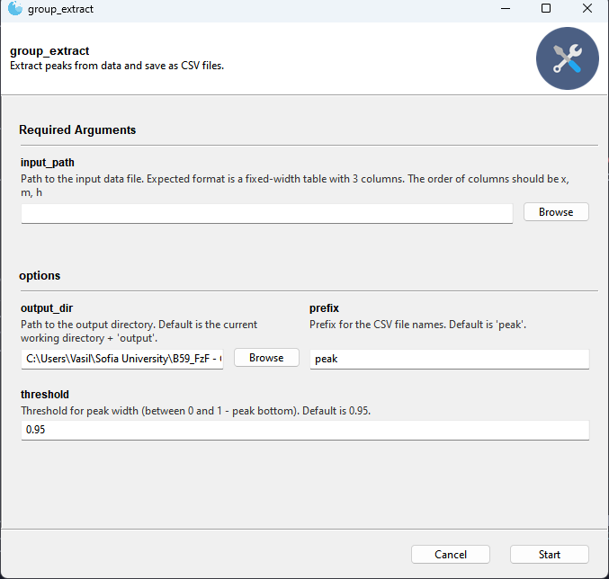

# Bunch analysys

## General (Start here)

### Installing git

If you don't have git installed you can download and install it from the official
website here:

https://git-scm.com/downloads

### Windows (Powershell)

1. Clone the repository:

```shell
git clone https://github.com/B59-PhysSU/bunch-analysis.git $env:USERPROFILE\bunch-analysis
```

2. Change to the directory of the cloned repo:

```shell
cd $env:USERPROFILE\bunch-analysis
```

3. Install the dependencies for all scripts by running in a terminal:

```shell
pip install -r requirements.txt
```

### Linux (Bash)

1. Clone the repository:

```shell
git clone https://github.com/B59-PhysSU/bunch-analysis.git ~/bunch-analysis
```

2. Change to the directory of the cloned repo:

```shell
cd ~/bunch-analysis
```

3. Install the dependencies for all scripts by running in a terminal:

```shell
pip install -r requirements.txt
```

## group_extract.py

**Make sure you've read the general section first!**

Given a trajectory (**a table with columns x, h, m in fixed-width Fortran format**)
this script identifies all bunches and saves them as CSVs to analyze later.
Bunches are saved both "as-is" and with x rescaled to zero versions 
of themselves.

### How to use

```shell
python group_extract.py
```

This will bring up the following UI:





#### Basic Usage

1. Click the **Browse** button for the **input_path** field at the top and select the trajectory (**.dat file**).

2. Press **Start**

#### Advanced Usage

1. Click the **Browse** button for the **input_path** field at the top and select the trajectory (**.dat file**).
2. You can select a different output_dir than the default one using the **Browse** button for the **output_dir** field.
3. Choose a different prefix for extracted CSV files (default is "peak")
4. Select a peak extraction threshold (the smaller the value, the smaller the width of the extracted peak).


#### Running in pure terminal mode

If you do not want to run in GUI mode (for automation purposes for example), you can start this script
using the following command:

```shell
$ python .\group_extract.py --ignore-gooey --help
usage: group_extract.py [-h] [-o OUTPUT_DIR] [-p PREFIX] [-t THRESHOLD] input_path

Extract peaks from data and save as CSV files.

positional arguments:
  input_path            Path to the input data file. Expected format is a fixed-width table with 3 columns. The order of columns should be x, m, h

options:
  -h, --help            show this help message and exit
  -o OUTPUT_DIR, --output_dir OUTPUT_DIR
                        Path to the output directory. Default is the current working directory + 'output'.
  -p PREFIX, --prefix PREFIX
                        Prefix for the CSV file names. Default is 'peak'.
  -t THRESHOLD, --threshold THRESHOLD
                        Threshold for peak width (between 0 and 1 - peak bottom). Default is 0.95.
```
